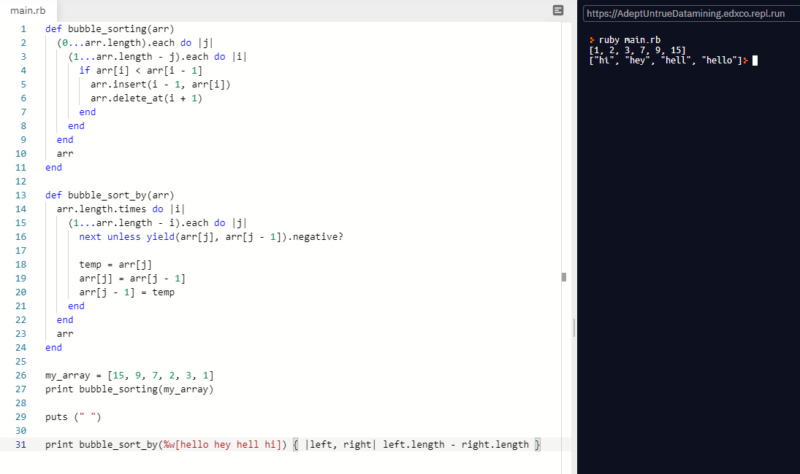

# Advanced Building Blocks - Bubble Sort

In this project we:

- Used Ruby to implement the algorithm;
- Built two bubble sort methods (bubble_sort and bubble_sort_by);
- Focused on the use of yield and passing a block to a method.

# What it does

Build a method #bubble_sort that takes an array and returns a sorted array.

## Built with

Ruby

## Live Demo

[Click for live webpage](https://repl.it/@edxco/AdeptUntrueDatamining)

## Getting Started

You will be redirected to a webpage where you can provide a list of numbers or strings to be sorted when you run the code.

## Author 1

- Github: [@edxco](https://github.com/edxco)
- Twitter: [@lalo_nbc](https://twitter.com/lalo_nbc)
- Linkedin: [linkedin](https://www.linkedin.com/in/eduardo-n-baeza/)

## Author 2

- Github: [@ricardomonte](https://github.com/ricardomonte)
- Twitter: [@ramnkco](https://twitter.com/ramnkco)
- LinkedIn: [Ricardo Montenegro](https://www.linkedin.com/in/ricardo-antonio-montenegro-nu%C3%B1ez-87a74944/)

## 🤝 Contributing

Contributions, issues and feature requests are welcome! Start by:

- Forking the project
- Cloning the project to your local machine
- `cd` into the project directory
- Run `git checkout -b your-branch-name`
- Make your contributions
- Push your branch up to your forked repository
- Open a Pull Request with a detailed description to the development branch of the original project for a review

## Show your support

Give a ⭐️ if you like this project!